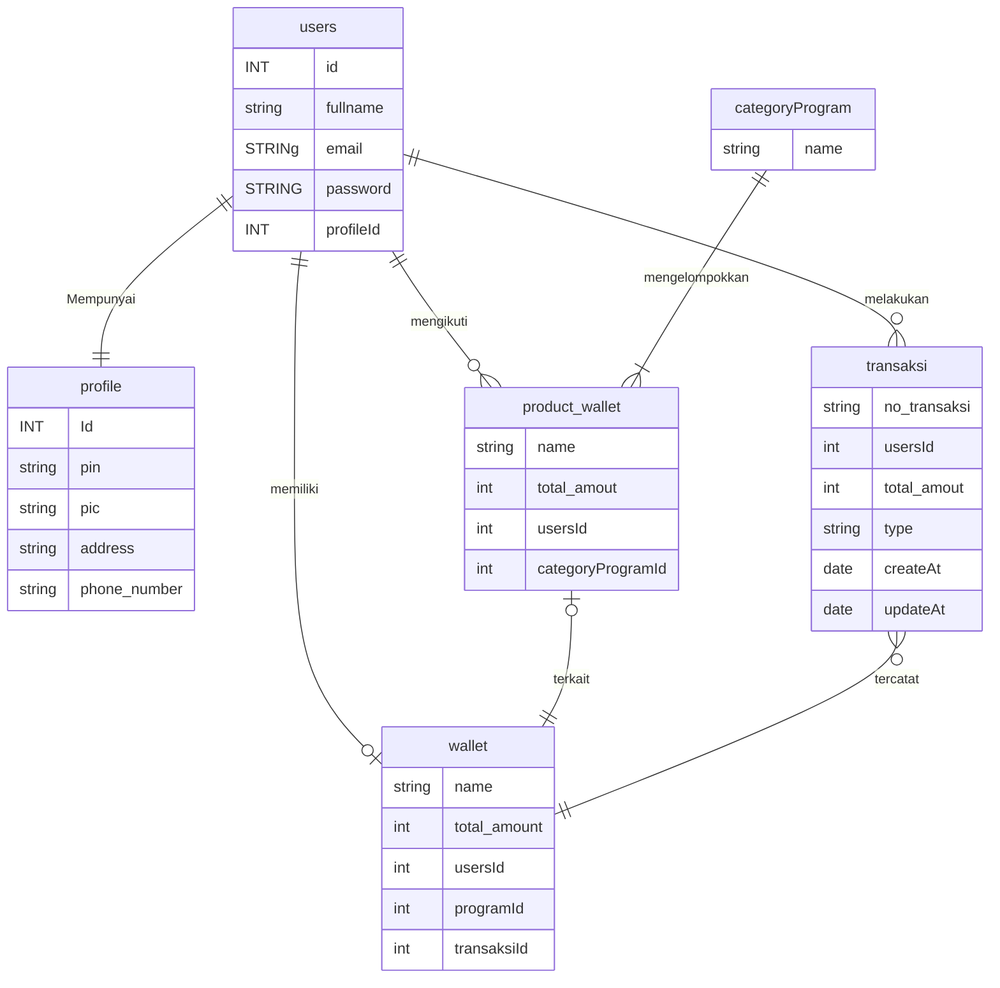

# ERD sistem E-Wallet
ERD yang di buat untuk membuat gambaran untuk struktur database yang akan di buat untuk sistem e-wallet

## Preview

```mermaid
erDiagram

users {
    INT id
    string fullname
    STRINg email
    STRING password
    INT profileId 
    
}

profile{
    INT Id
    string pin
    string pic
    string address
    string phone_number
}

wallet {
    string name
    int total_amount
    int usersId
    int programId
    int transaksiId
}

product_wallet {
    string name
    int total_amout
    int usersId
    int categoryProgramId
}

categoryProgram {
    string name
}

transaksi {
    string no_transaksi
    int usersId
    int total_amout
    string type
    date createAt
    date updateAt
}

users ||--o| wallet : memiliki
users ||--o{ product_wallet : mengikuti
users ||--o{ transaksi : melakukan
categoryProgram ||--|{ product_wallet : mengelompokkan
product_wallet |o--|| wallet : terkait
transaksi }o--|| wallet : tercatat
users||--||profile : Mempunyai
```