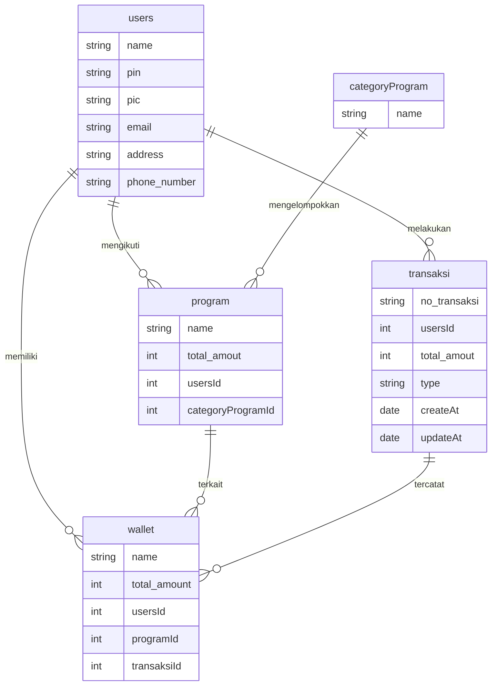

```mermaid
erDiagram

users {
    string name
    string pin
    string pic
    string email
    string address
    string phone_number
}

wallet {
    string name
    int total_amount
    int usersId
    int programId
    int transaksiId
}

program {
    string name
    int total_amout
    int usersId
    int categoryProgramId
}

categoryProgram {
    string name
}

transaksi {
    string no_transaksi
    int usersId
    int total_amout
    string type
    date createAt
    date updateAt
}

users ||--o{ wallet : memiliki
users ||--o{ program : mengikuti
users ||--o{ transaksi : melakukan
categoryProgram ||--o{ program : mengelompokkan
program ||--o{ wallet : terkait
transaksi ||--o{ wallet : tercatat

```